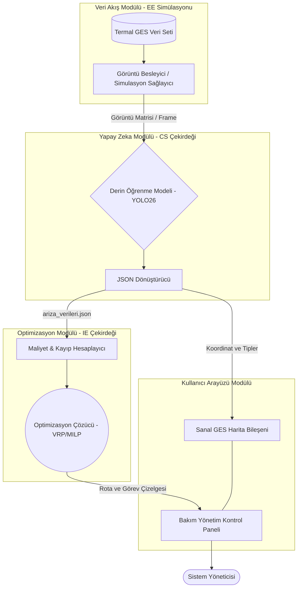
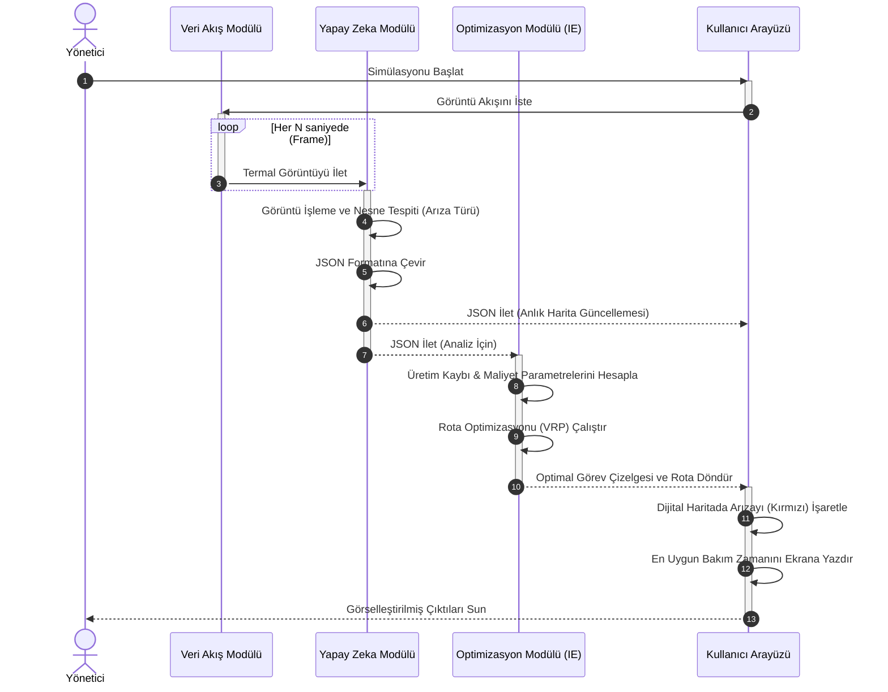
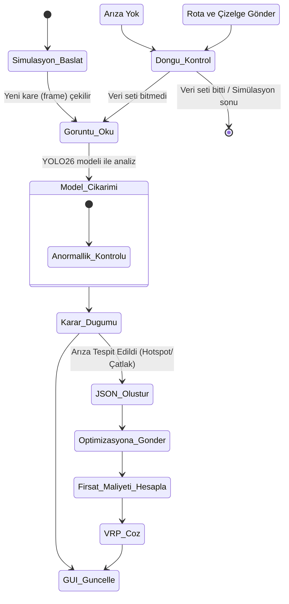

# Güneş Enerjisi Santralleri (GES) Karar Destek Sistemi - Modüler Mimari ve UML Tasarımı

Bu belge, disiplinler arası proje için geliştirilecek yazılımın temel yapı taşlarını ve sistem modüllerinin birbirleriyle olan ilişkilerini UML standartlarında tanımlamaktadır. Sistem, bilgisayar destekli bir simülasyon ortamında çalışacak şekilde temel olarak 4 bağımsız katmana ayrılmıştır.

## 1. Modüler Mimari Katmanları

Sistem birbiriyle tam entegre ancak yalıtılmış (gevşek bağlı) çalışan, bakımı ve genişletilmesi kolay 4 temel modülden oluşmaktadır:

1. **Veri Akış Modülü (EE Simülasyonu / Veri Sağlayıcı):**
   Fiziksel bir İHA uçuşu gerçekleştirilmeyeceği için donanımdan gelecek veri akışını simüle eden katmandır. Önceden toplanmış olan GES termal hesaplama ve RGB fotoğraflarını (ya da video karelerini) içeren veri setini zaman ayarlı olarak sisteme besler. Tıpkı bir drone otopilot sisteminden anlık veri alıyormuş gibi, görüntü girdisinin yanında panelin GPS koordinatlarını, uçuş yüksekliğini ve sensör değerlerini de meta veri (EXIF/Telemetry) şeklinde yapay zeka modülüne iletir.
2. **Yapay Zeka Modülü (CS Çekirdeği / Görüntü İşleme):**
   Gelen anlık görüntüleri nesne tespiti yaklaşımıyla analiz eden sistemin kalbidir. Bu projede, sınıflandırma isabeti ve anlık işleme performans açısından son teknoloji **YOLO26** mimarisi kullanılacaktır. YOLO26 modeli, güneş panellerindeki "hotspot (ısınma noktası)", "mikro-çatlak" ve "tozlanma" gibi arızaları yüksek hassasiyetle (bounding box ve güven skoru ile) saniyeler içinde tespit eder. Model sadece tespit (inference) yapar; bulgularını optimizasyon katmanının kolayca okuyabilmesi için standart, dilden bağımsız bir JSON formatına dönüştürür.
   _(Örn çıktı: `{"timestamp": "2026-03-27T10:15:00", "panel_id": 42, "gps": [38.123, 27.456], "hasar": "hotspot", "koordinat": [x,y,w,h], "guven_skoru": 0.94}`)_
3. **Optimizasyon Modülü (IE Çekirdeği / Karar Destek Sistemi):**
   Matematiksel modelleme kurallarının işlediği ve karar destek algoritmalarının koştuğu stratejik katmandır. YZ modülünden nesne tespiti tamamlanarak sunulan JSON çıktılarını otomatik olarak okur. Parametrik girdileri alarak; _Arızanın engellediği tahmini kW bazlı üretim kaybı (fırsat maliyeti) nedir?_ ve _Bu arızayı gidermenin teknisyen ile araç maliyeti nedir?_ denklemleri üzerinden Karma Tamsayılı Doğrusal Programlama (MILP) modelini işletir. Ardından SciPy, Gurobi veya CPLEX kullanarak Dinamik Araç Rotalama (VRP) ağını çözer; sahada maliyeti en aza indirecek optimal bakım ekibi görev çizelgesini (Scheduling) yaratır.
4. **Kullanıcı Arayüzü (GUI) Modülü (Sunum Katmanı):**
   Görüntüleme ve yönetimin yapıldığı sunum katmanıdır. Python ortamında modern ve akıcı grafik arayüz sunan PyQt6 veya CustomTkinter tabanlı bir masaüstü (Dashboard) uygulaması olacaktır. İçerisinde santral sahasının etkileşimli bir dijital ikizini (harita) barındırır. YOLO26 destekli yapay zekanın bulduğu arızaları santral haritasında kırmızı ibareler/ısı haritası ile gerçek zamanlı sunarken, optimizasyon modülünden gelen rotaları "Bu hafta yapılacak görevler" gibi sade tablolar ve yönlendirme panelleri halinde kullanıcıya yansıtır.

---

## 2. UML Diyagramları

### 2.1. Bileşen (Component) Diyagramı

Modüllerin yapısal olarak nasıl ayrıldığını ve birbirlerine hangi veri tipleriyle (Interface) bağlandıklarını gösterir. Gevşek bağlı (loose coupling) bir mimari hedeflenmiştir.

### 2.2. Sıra (Sequence) Diyagramı

Zamana bağlı olarak modüllerin birbirleriyle nasıl iletişime geçtiğini adım adım tanımlar.

### 2.3. Aktivite (Activity) Diyagramı

Sistemin mantıksal karar verme süreçlerini (if-else akışlarını) ve arıza durumunda nasıl bir iş akışı yürüttüğünü gösterir.

