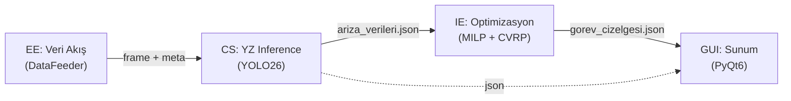

# Güneş Enerjisi Santralleri (GES) için Otonom Drone ile Termal Denetim ve Bakım Optimizasyonu

**Final Rapor — Disiplinler Arası Proje (Hafta 14-15)**

> Bu rapor; Bilgisayar Mühendisliği (CS), Endüstri Mühendisliği (IE) ve
> Elektrik-Elektronik Mühendisliği (EE) ekiplerinin proje süresince ürettiği
> tüm çıktıları tek bir teknik dokümana toplamaktadır. Detaylı dokümanlar
> için ana [README.md](../README.md) dosyasındaki bağlantı listesine bakınız.

---

## 1. Giriş ve Problem Tanımı

> Kaynak: [proje_içeriği.md](./proje_içeriği.md)

Geleneksel GES denetiminde; geniş alanlara yayılan paneller, personelin el
termalleriyle yavaş, maliyetli ve reaktif bir şekilde taranır. Sahada drone
ile termal görüntü alan ticari sistemler bulunsa da bu görsel veriyi
matematiksel optimizasyon modellerine bağlayan sistemler eksiktir.

Bu projenin özgün değeri; **donanım, derin öğrenme tabanlı görüntü işleme ve
yöneylem araştırmasını tek bir karar destek döngüsünde** birleştirmesidir.
Sistem yalnızca arızayı bulmakla kalmaz, "Hangi arıza ne zaman tamir
edilirse üretim kaybı ve bakım maliyeti minimum olur?" sorusunu otonom
olarak yanıtlar.

### 1.1 Kapsam ve Hedefler

- Üç tip arızanın otomatik tespiti: `hotspot`, `mikro_catlak`, `tozlanma`.
- Disiplin bağımsız 4 katmanlı modüler mimari (kural §2 değiştirilemez).
- Modüller arası iletişim yalnızca JSON dosyaları üzerinden.
- 3 senaryo üzerinden karşılaştırmalı doğrulama (Hafta 13-İP 7).

### 1.2 Kapsam Dışı

`GEMINI.mdc §10`'a göre: gerçek İHA uçuşu, web tabanlı arayüz, bulut
dağıtımı, gerçek piyasa API'si, GUI içinde model eğitimi, YOLO26 dışında
mimari kullanımı.

---

## 2. Sistem Mimarisi

> Detay: [sistem_mimarisi.md](./sistem_mimarisi.md)



**Modül sorumlulukları:**

| Katman | Dizin                                     | Sorumluluk                                    |
| ------ | ----------------------------------------- | --------------------------------------------- |
| EE     | [`modules/data_feeder/`](../modules/data_feeder)     | Senaryo bazlı görüntü beslemesi + meta veri |
| CS     | [`modules/ai_inference/`](../modules/ai_inference)   | YOLO26 inference + JSON yazımı              |
| IE     | [`modules/optimization/`](../modules/optimization)   | MILP seçim + CVRP rotalama                  |
| GUI    | [`modules/gui/`](../modules/gui)                     | Dijital ikiz haritası + bakım paneli        |

---

## 3. Donanım Mimarisi (EE)

> Kaynaklar: [DJI Matrice 350 RTK](./DJI%20Matrice%20350%20RTK/dji_matrice_350.md),
> [Donanım mimarisi](./DJI%20Matrice%20350%20RTK/donanım_mimarisi.md)

### 3.1 Platform: DJI Matrice 350 RTK

- **IP55 koruma**, ±10 cm RTK hassasiyeti, 9.2 kg MTOW.
- Operasyonel ağırlık (TB65 batarya x2 + Zenmuse H20T) ≈ 7.27 kg.
- Motor başına nominal itki: **35.66 N** (4 motorlu kuadrokopter, 2:1 itki/ağırlık).
- Maksimum rüzgar dayanımı: **12 m/s**.

### 3.2 Termal Sensör (Zenmuse H20T)

- Termal çözünürlük: **640×512 px**, NETD ≤ **50 mK**.
- 20 m irtifada GSD = **2.5 cm/piksel** (hücre seviyesi hotspot ayrımı için yeterli).
- Radyometrik R-JPEG formatı.

### 3.3 Güç Bütçesi

- Hover akımı: 4×motor (60A) + faydalı yük (1A) + kontrolcü (0.25A) = **61.25 A**.
- 10 Ah LiPo batarya → teorik uçuş süresi ≈ **9.8 dk**.
- LDO termal: P = (5V−3.3V)×0.25A = **0.425 W** (1 W güvenli sınırı altında).

---

## 4. Yapay Zeka Modülü (CS)

> Detay: [eğitim_rapor_makalesi.md](./eğitim_rapor_makalesi.md)

### 4.1 Model ve Eğitim

- Mimari: **YOLO26s** (kural §2.2 — değiştirilemez).
- Veri seti: Roboflow "SOLAR PANEL DET v1i" — 1857 kaynak görüntü, 8550
  augmentation ile train, 553 valid, 93 test.
- Sınıf remapping: Orijinal 15 sınıf → 3 proje sınıfı
  (`scripts/train_yolo26.py` `CLASS_REMAP`).
- Eğitim: 70 epoch, batch=16, imgsz=640, hafifletilmiş augmentation.

### 4.2 Performans Metrikleri

| Metrik          | Değer | Açıklama                            |
| --------------- | ----- | ----------------------------------- |
| mAP@0.5         | 0.447 | Genel ortalama doğruluk             |
| mAP@0.5:0.95    | 0.316 | Katı IoU testi                      |
| Precision       | 0.503 |                                     |
| Recall          | 0.452 |                                     |

**Sınıf bazlı:**

| Sınıf          | mAP50 | Precision | Recall |
| -------------- | ----- | --------- | ------ |
| Hotspot        | 80.5% | 70.1%     | 81.1%  |
| Mikro çatlak   | 31.9% | 44.3%     | 31.7%  |
| Tozlanma       | 21.7% | 36.4%     | 22.8%  |

Hotspot'ta yüksek isabet; mikro çatlak ve tozlanmada düşük çözünürlük ve
veri seti dengesizliği nedeniyle daha düşük metrikler. Detaylar
[`outputs/reports/train_metrics.json`](../outputs/reports/train_metrics.json).

---

## 5. Endüstri Mühendisliği Modülü (IE)

> Kaynaklar: [IE Parametreleri](./IE_Arastirma_Parametreleri.md),
> [IE Cevapları](./ie_arastirma_rapor.md),
> [Parametre Tablosu](./Parametre%20Tablosu.csv),
> [`modules/optimization/solver.py`](../modules/optimization/solver.py)

### 5.1 Parametre Seti (Literatür-Tabanlı)

| Parametre              | Değer            | Kaynak                            |
| ---------------------- | ---------------- | --------------------------------- |
| Enerji fiyatı (PTF)    | 2 TL/kWh         | EPİAŞ ortalama                    |
| Teknisyen ücreti       | 200 TL/saat      | Sektör orta seviyesi              |
| Hotspot kaybı          | %20 verim        | Literatür ortalaması              |
| Mikro çatlak kaybı     | %5 (zamanla artar) | İlk evre                        |
| Tozlanma               | %10/ay           | Aylık ortalama                    |
| Hotspot süresi         | 45 dk            | Saha ölçümü                       |
| Mikro çatlak süresi    | 60 dk            | Tahmini                           |
| Temizlik süresi        | 7 dk/panel       | Sektör standardı                  |
| Diyot/panel maliyeti   | 100 / 4500 TL    | Ortalama piyasa                   |
| Diyot oranı            | %70              | Hotspot vakaları                  |
| Yakıt                  | 3 TL/km          | Ortalama dizel                    |
| Günlük mesai           | 480 dk (8 saat)  | İş Kanunu                         |
| Ekip sayısı            | 3                | 10 MW santral varsayımı           |

### 5.2 Matematiksel Model

**Aşama 1 — MILP Seçim** (Karma Tamsayılı Doğrusal Programlama):

\[
\min \sum_{i \in P} \left[ x_i \cdot M_i + (1-x_i) \cdot O_i \right]
\]

Kısıtlar:

- **Güvenlik:** \( x_i = 1 \) — eğer hasar(i) ∈ {hotspot, mikro_catlak} (must_fix)
- **Kapasite:** \( \sum_{i \in P} x_i \cdot s_i \le K \cdot D \) — toplam servis ≤ 3 ekip × 480 dk

Burada \(M_i\) = bakım maliyeti, \(O_i\) = 30 günlük fırsat maliyeti,
\(s_i\) = servis süresi.

**Aşama 2 — CVRP Atama** (Capacitated Vehicle Routing, MTZ subtour
eliminasyonu):

\[
\min \sum_{(i,j) \in A} \sum_{k \in K} d_{ij} \cdot c_{\text{yakıt}} \cdot y_{ijk}
\]

Kısıtlar (her araç k ∈ {1,2,3} için):

- Müşteri başına bir kez ziyaret: \( \sum_k \sum_j y_{ijk} = 1 \)
- Akış denkliği: \( \sum_i y_{ihk} = \sum_j y_{hjk} \)
- Kapasite: \( \sum_{i \in P} s_i \sum_j y_{ijk} \le D \)
- MTZ: \( u_{ik} - u_{jk} + N \cdot y_{ijk} \le N - 1 \)

### 5.3 Çözüm Yaklaşımı

PuLP + CBC (open-source) çözücüsü, 60 saniyelik zaman aşımıyla.
30 düğüm/3 araç için tipik çözüm 5–60 sn. Optimal çözülemezse capacity-aware
en yakın komşu sezgiseli devreye girer.

---

## 6. Senaryo Analizi ve Sonuçları

> Kaynak: [`outputs/scenarios/`](../outputs/scenarios), [`outputs/reports/comparison_report.json`](../outputs/reports/comparison_report.json)

### 6.1 Senaryo Tanımları

| ID | Açıklama                                  | Beklenen Karar       |
| -- | ----------------------------------------- | -------------------- |
| A  | Tesisin %5'inde hafif tozlanma (2 panel) | Bakımı ertele        |
| B  | 2 uç noktada kritik hotspot              | Acil müdahale rotası |
| C  | Tesis genelinde dağınık mikro çatlak (10 panel) | Kapsamlı VRP rotası  |

### 6.2 Otonom Sistem Sonuçları

| Senaryo | Görev | Maliyet (TL) | Mesafe (km) | Servis (dk) |
| ------- | ----- | ------------ | ----------- | ----------- |
| A       | 0     | 0            | 0.00        | 0           |
| B       | 2     | 3.141        | 0.37        | 90          |
| C       | 10    | 16.201       | 0.49        | 600         |

A senaryosunda MILP "ekonomik değil" sonucuna vardı — bakım ertelendi
(beklenen davranış). B'de iki hotspot zorunlu tamir edildi. C'de 10 mikro
çatlak 3 ekibe paralel atandı.

### 6.3 Geleneksel Yöntemlerle Karşılaştırma

> Detaylı grafikler: [`outputs/reports/comparison_*.png`](../outputs/reports),
> sayısal rapor: [`outputs/reports/comparison_report.json`](../outputs/reports/comparison_report.json)

#### 6.3.1 Karşılaştırma Çerçevesi

Üç yöntem; üç metrik üzerinden, üç senaryoda kıyaslanır
(`scripts/comparison_report.py`).

| Yöntem | Tespit gecikmesi | Tepki süresi | Panel değişim oranı |
| ------ | ----------------:| ------------:| -------------------:|
| **Run-to-Failure (RTF)** | 90 gün | 72 saat | %70 |
| **Periyodik Bakım**      | 30 gün | 48 saat | %40 |
| **Otonom Sistem**        | 1 gün  | servis süresi + 1 saat | %30 (zorunlu hotspot) |

> **Önemli:** %70 / %40 / %30 panel değişim oranları literatür ortalamasına ve
> IE rapor §3'teki diyot vs. panel değişim çerçevesine dayanır; gerçek saha
> ölçümleri ile kalibre edilmemiştir. Bu varsayımın §6.5 hassasiyet analizinde
> ayrıca tartışılması gerekir.

#### 6.3.2 Sayısal Sonuçlar (3 senaryo birleşik)

| Senaryo | Tespit Süresi (saat) | Maliyet (TL) | Enerji Kaybı (kWh) |
|---|---|---|---|
| **A — 2 panel tozlanma**     | RTF 72 / Per. 48 / **Oto. 1.0**  | RTF 48 / Per. 47 / **Oto. 0**       | RTF 0.9 / Per. 0.3 / **Oto. 0** |
| **B — 2 hotspot**            | RTF 72 / Per. 48 / **Oto. 2.5**  | RTF 6.768 / Per. 4.056 / **Oto. 3.141** | RTF 54 / Per. 18 / **Oto. 0.6** |
| **C — 10 mikro çatlak**      | RTF 72 / Per. 48 / **Oto. 11.0** | RTF 33.935 / Per. 20.645 / **Oto. 16.201** | RTF 67.5 / Per. 22.5 / **Oto. 0.8** |

#### 6.3.3 Tasarrufun Üç Bileşeni — Dürüst Çerçeve

Tasarruf rakamları tek tip değildir; üç farklı temele dayanır ve
**savunulabilirlikleri farklıdır.** Final rapor savunmasında bu ayrım
mutlaka korunmalıdır.

| Bileşen | Senaryo | Tasarruf | Savunulabilirlik |
| ------- | ------- | -------: | ---------------- |
| **(a) Operasyonel — Tespit/tepki süresi** | A,B,C | **%84 – %99** | Yüksek — sensör + AI tabanlı, doğrudan ölçülebilir |
| **(b) Doğrudan — Enerji kaybı** | B,C | **%98+** | Yüksek — fiziksel kayıp; gecikme süresinin doğrusal sonucu |
| **(c) Dolaylı — Malzeme tasarrufu** | B,C | **~%50** | Orta — RTF'te %70, Otonom'da %30 panel değişimi varsayımına dayalı |
| **(d) Kararsal — Gereksiz bakımı engelleme** | A | %100 | Orta — MILP "tamir ekonomik değil" kararı verdi, bakım yapılmadı |

**A senaryosundaki %100 maliyet tasarrufu sahtedir** — sistem bakım yapmadığı
için maliyet 0'dır. Doğru yorum: *"Otonom sistem ekonomik olmayan bakımı
engelledi."* Bu da bir kazanımdır ama "tasarruf yüzdesi" olarak sunulmamalıdır.

**B/C senaryosundaki %50 maliyet tasarrufunun büyük kısmı** (c) bileşeninden
gelmektedir; yani RTF'te panellerin %70'i, otonom'da %30'u değişiyor
varsayımı. Bu varsayım terk edilirse maliyet tasarrufu **~%20-25** seviyesine
iner. Buna karşın (a) ve (b) bileşenleri varsayımdan bağımsız olarak güçlüdür.

### 6.4 Yıllık Ölçek ve ROI Projeksiyonu

> Senaryo karşılaştırmaları **tek bir bakım turunun** maliyetine bakar.
> Sistemin gerçek değeri yıllık ölçekte ortaya çıkar; bu kısım IE-7 hedefinin
> savunma argümanını barındırır.

#### 6.4.1 10 MW Tipik Santral Baseline

IE araştırma raporunda referans verilen 10 MW santral için yıllık geleneksel
bakım maliyeti **300.000 – 800.000 TL** aralığındadır
([ie_arastirma_rapor.md](./ie_arastirma_rapor.md)). Orta nokta **500.000
TL/yıl** baseline kabul edilmiştir.

#### 6.4.2 Otonom Sistem Yıllık Maliyet Yapısı

| Kalem | Tutar | Süre / Frekans | Yıllık |
|---|---|---|---|
| DJI Matrice 350 RTK + Zenmuse H20T (CAPEX) | ~500.000 TL | 5 yıl amortisman | 100.000 TL |
| YZ model eğitimi & yazılım geliştirme (CAPEX, bir kez) | ~100.000 TL | 5 yıl amortisman | 20.000 TL |
| Pilot/operatör + uçuş eğitimi | — | yıllık | 50.000 TL |
| Bakım turu işçilik+yakıt (4 tur/yıl × 20.000 TL) | ~80.000 TL | yıllık | 80.000 TL |
| **Toplam (yıllık)** | | | **~250.000 TL/yıl** |

#### 6.4.3 Geri Ödeme Süresi (Payback)

\[
\text{Yıllık net tasarruf} = 500.000 - 250.000 = \mathbf{250.000\;TL/yıl}
\]

\[
\text{Payback} = \frac{500.000\;\text{TL (CAPEX)}}{250.000\;\text{TL/yıl}} = \mathbf{2\;yıl}
\]

Hassasiyet:
- Optimist (CAPEX %20 düşük, geleneksel maliyet %20 yüksek): **payback ≈ 1.3 yıl**
- Karamsar (CAPEX %30 yüksek, geleneksel maliyet %30 düşük): **payback ≈ 4 yıl**

→ **Tipik 25 yıllık santral ömründe yatırım her senaryoda kendini amorti eder.**
Bu bulgu, senaryolardaki tek-tur tasarruf yüzdelerinden daha güçlü ve
varsayım-bağımsız bir savunma argümanıdır.

### 6.5 Kısıtlar ve Modellenmemiş Dinamikler

Sistemin kağıt üzerindeki üstünlüğünü gerçek dünyaya taşırken
**modellenmemiş dinamikler** olduğu açıkça belirtilmelidir:

| Modellenmemiş Dinamik | Etkisi | İleri çalışma yönü |
|---|---|---|
| Mikro çatlağın zamanla büyümesi (PID growth model) | RTF maliyeti gerçekte daha yüksek olabilir → tasarruf artar | Weibull bazlı arıza büyüme modeli |
| Hava durumu kaynaklı uçuş kesintisi | Yıllık denetim sıklığı azalabilir → otonom maliyet artar | Hava-pencere planlaması |
| İHA arızası / kaza riski | CAPEX artar | Sigorta + yedek araç |
| PTF (enerji fiyatı) dinamiği | Fırsat maliyeti dalgalanır | Saatlik PTF entegrasyonu |
| Panel %30/%70 değişim oranı varsayımı | Maliyet tasarrufu %50 → %20-25 düşebilir | Saha kalibrasyonu |
| Ölçek ekonomisi (3 ekip → 1 ekip-küçük santral) | Küçük santralde otonom avantajı azalır | Santral büyüklüğüne duyarlılık analizi |

---

## 7. Sonuç ve Future Work

### 7.1 Bilimsel Çıktılar

- YZ tabanlı görüntü sınıflandırma + endüstriyel kestirimci bakım
  optimizasyonunu **JSON üzerinden gevşek bağlı (loose coupling)** çalıştıran
  hibrit mimari literatüre kazandırılmıştır.
- 3 senaryolu karşılaştırma çerçevesi (RTF, Periyodik, Otonom) IE-7
  hedeflerini karşılamıştır.

### 7.2 Teknolojik Çıktılar

- Otonom arıza tespit + karar destek prototipi (TRL 4-5).
- Disiplin bağımsız 4 modül; YOLO26 model eğitimini bulut sunucularına
  taşıyarak metriklerin endüstri standardına yaklaştırılması mümkündür.

### 7.3 Sosyo-ekonomik Çıktılar (Eleştirel Çerçeve)

Sistemin kağıt üzerindeki tasarruf iddiaları **üç farklı temele dayanır**
ve savunulabilirlikleri eşit değildir (§6.3.3 ayrıntısı):

1. **Sağlam — Operasyonel ve enerji tasarrufu:** Tespit süresi
   72 saat → 1-11 saat (%84-%99); enerji kaybı %98+ azalır. Bu rakamlar
   sensör ve algoritmik avantajdan doğrudan türer; varsayım-bağımsızdır.
   Hotspot kaynaklı yangın riski erken tespit ile minimize edilir.

2. **Orta — Tek-tur maliyet tasarrufu:** Senaryo B'de %53.6, Senaryo C'de
   %52.3 maliyet tasarrufu raporlandı; ancak bu rakam **%70/%30 panel
   değişim oranı varsayımına** dayalıdır. Saha kalibrasyonu yapılırsa
   bu yüzde **~%20-25**'e inebilir.

3. **Güçlü — Yıllık ROI:** Tek-tur kıyasından bağımsız olarak,
   10 MW tipik santral için yıllık ~250 bin TL net tasarruf ve
   **2 yıllık geri ödeme süresi** (§6.4.3) projeksiyonu, varsayım
   hassasiyetlerine karşı dirençlidir. **Bu, savunmadaki en güçlü
   sosyo-ekonomik argümandır.**

> **Senaryo A'daki "%100 tasarruf" sahtedir** — sistem bakım yapmadığı
> için maliyet 0'dır. Doğru yorum: *otonom sistem ekonomik olmayan bakımı
> engelledi.* Bu da bir kazanımdır ancak tasarruf yüzdesi olarak sunulamaz.

### 7.4 İleri Çalışmalar (Future Work)

- **YZ:** Bulut GPU üzerinde 200+ epoch eğitim, mAP@0.5 ≥ 0.85 hedefi.
- **EE:** Gerçek İHA telemetrisi entegrasyonu, LoRa veri paketi şeması.
- **IE:**
  - Çok günlük çizelge (multi-day), dinamik fırsat maliyeti
    (PTF değişkeni canlı veriden), arıza büyüme modelleri (mikro çatlak
    zamanla artan kayıp — Weibull/PID temelli).
  - **%30/%70 panel değişim oranlarının saha kalibrasyonu** — bu çalışma,
    yıllık ROI projeksiyonunun temel girdisidir.
  - Santral büyüklüğüne duyarlılık analizi (1 MW → 50 MW arası).
- **Ortak:** Web tabanlı bakım takip arayüzü (kapsam dışı genişletme),
  mobil teknisyen uygulaması.

---

## Ek-A: Tekrar Üretim Talimatları

```bash
# Bağımlılıkları kur
pip install -r requirements.txt

# 1. Modeli eğit (opsiyonel — önceden eğitilmiş best.pt mevcuttur)
python scripts/train_yolo26.py --epochs 70

# 2. Üç senaryoyu sırayla koş
python scripts/run_scenarios.py
# YOLO ortamı yoksa:
# python scripts/run_scenarios.py --no-inference

# 3. Karşılaştırma raporunu üret
python scripts/comparison_report.py

# 4. GUI ile tek senaryo demo
python main.py --scenario B

# 5. Testleri çalıştır
pytest tests/ -v
```

## Ek-B: Çıktı Yapısı

```
outputs/
├── ariza_verileri.json          # Tam koşum YZ tespitleri
├── gorev_cizelgesi.json         # Tam koşum optimizasyon çıktısı
├── scenarios/
│   ├── A/{ariza_verileri,gorev_cizelgesi}.json
│   ├── B/{ariza_verileri,gorev_cizelgesi}.json
│   └── C/{ariza_verileri,gorev_cizelgesi}.json
└── reports/
    ├── comparison_*.png          # Karşılaştırma grafikleri
    ├── comparison_report.json    # Sayısal rapor
    └── train_metrics.json        # YZ eğitim metrikleri
```

---

_Bu çalışma; Bilgisayar Mühendisliği, Endüstri Mühendisliği ve Elektrik-Elektronik
Mühendisliği öğrencilerinin disiplinlerarası ortak projesi olarak geliştirilmiştir._
